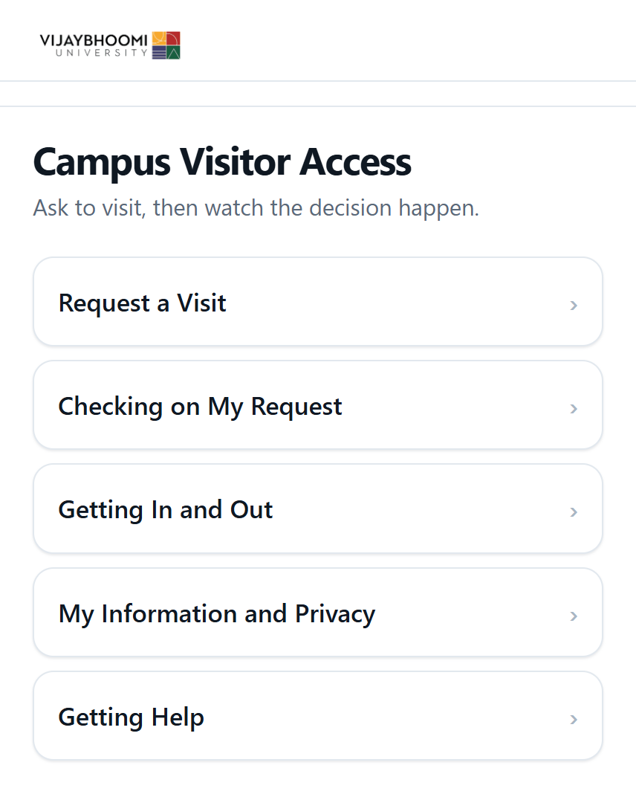
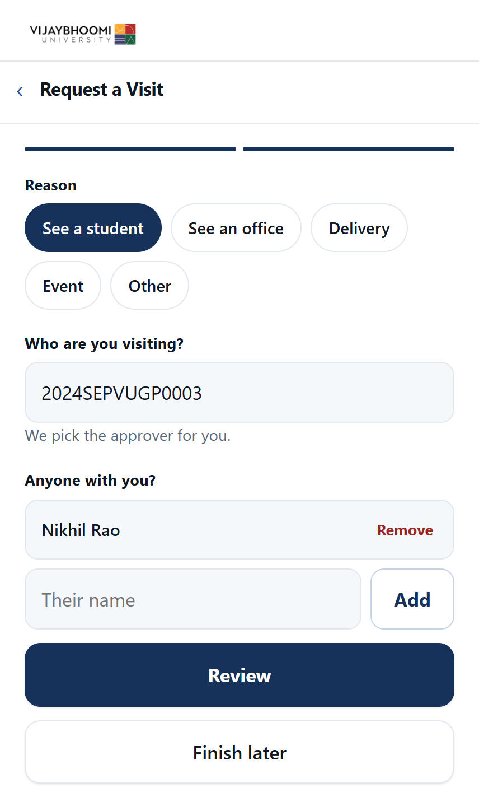
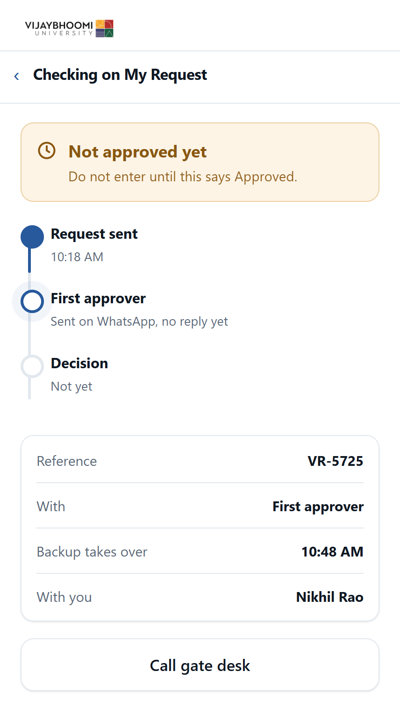
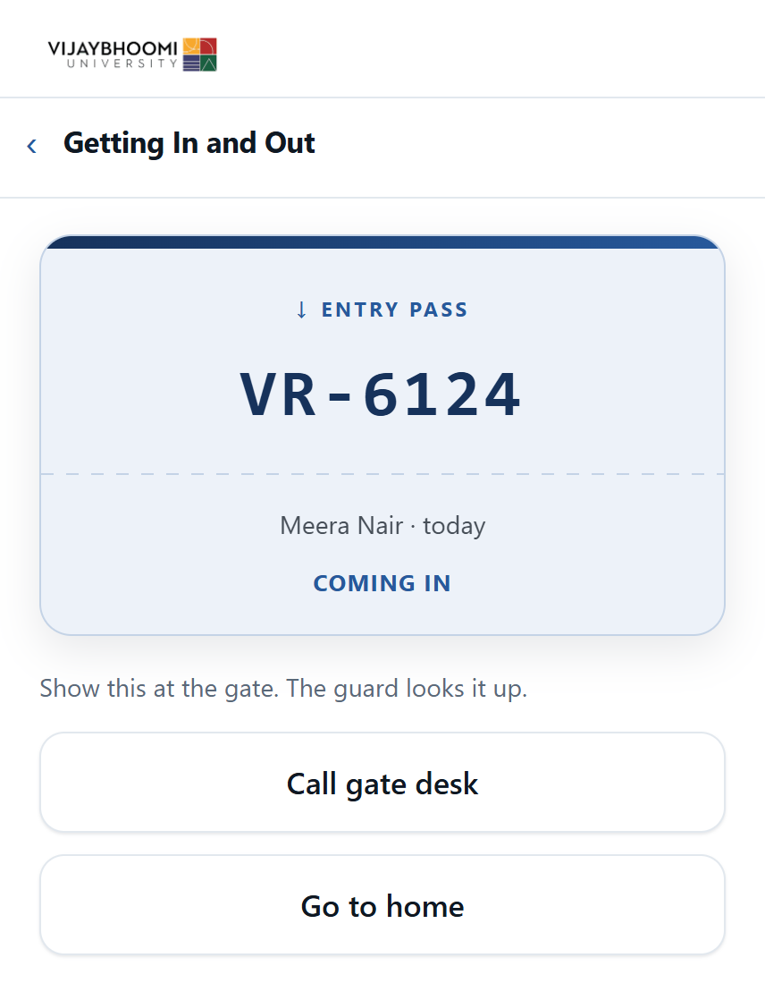
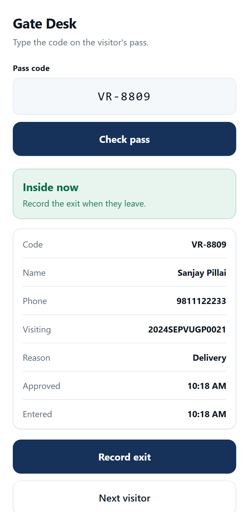

# Campus Visitor Access

> **Written up in full:
** [codex-crusader.github.io/projects/campus-visitor-access/](https://codex-crusader.github.io/projects/campus-visitor-access/)
> covers the problem, the architecture, the results and what it deliberately does not do.

**A product ideation study of the visitor entry system at Vijaybhoomi University, from research to a tested, working
prototype**

A parent drove three hours to visit her son. She started the check-in form an hour before she
arrived, so that she did not have to wait. She still stood in the rain outside the gate. She got
in when somebody inside the university made a phone call. The system did nothing to help her.

This repository studies why that happens, and proposes a fix. It covers research, information
architecture and prioritization, then design, then a usability test with eight people, then a
working app rebuilt from the test results.

Bhargavaram Krishnapur, 2026

## The finding

Entry runs through a visitor management system from an outside company. A visitor fills in six
screens at the gate, waits for someone to approve the request, and then gets a QR pass on
WhatsApp.

The form is annoying, but it is not the problem. A better form moves one step of the journey map
from -1 to 0. The lowest point stays at -5.

> [!IMPORTANT]
> The approval step has no owner, no time limit, and no failure path. If the person you named
> does not act, nothing is rejected. The system holds the request, then cancels it without
> telling you, and you start again.

So the recommendation is a timer. If the first approver does not answer in an agreed time, the
request moves to a named backup by itself. The visitor types nothing again. The guards already do
the same thing by phone.

## What testing found

Eight people tried the Figma prototype on 16 and 17 September 2026. They reported 97% of tasks as
done. But only 44% of their answers showed that they understood the screen. Five of eight thought
that a sent request was already approved. Only one of eight found how to add a second visitor.

The app fixes these problems. The waiting screen now opens with "Not approved yet". Every status
screen carries a "Call gate desk" button.

## The app

The working app lives in [`application/`](application/). A visitor fills in the form. The server
sends the details to an approver on WhatsApp. The approver replies `YES` or `NO`. The visitor sees
the decision on the same page within three seconds. At the gate, a guard checks the code, records
the entry and the exit, and the code then stops working.

|                                    Home                                    |                                                  Request a visit                                                   |                                                   Waiting on the approver                                                   |
|:--------------------------------------------------------------------------:|:------------------------------------------------------------------------------------------------------------------:|:---------------------------------------------------------------------------------------------------------------------------:|
|  |  |  |

|                                   Approved, with the pass                                   |                                                         The gate desk                                                         |
|:-------------------------------------------------------------------------------------------:|:-----------------------------------------------------------------------------------------------------------------------------:|
|  |  |

The waiting screen is the whole recommendation in one picture. It names who holds the request and
states the minute the backup approver takes over.
[`application/README.md`](application/README.md) covers the WhatsApp commands, the settings and
how to run it.

## How it was done

| Phase        | Method                                            | What it produced                                      |
|:-------------|:--------------------------------------------------|:------------------------------------------------------|
| Research     | Interviews: 1 visitor, 2 gate staff               | Persona, empathy map, journey map, core pain point    |
| Structure    | Card sort (8 valid) and tree test (5)             | A six-section menu, changed to five after testing     |
| Priorities   | MoSCoW and a DFV matrix                           | Four must-have features                               |
| Design       | Wireframes, heuristic inspection, prototype       | 16 screens, 3 heuristic fixes, a clickable Figma flow |
| Testing      | Unmoderated usability test (8)                    | 97% reported success against 44% real understanding   |
| Redesign     | Changes from the test, rebuilt in HTML            | A working app, embedded on the site                   |
| Benchmarking | Written comparison with three classmates' studies | Four answers to the same problem                      |

Fieldwork ran from 31 July to 5 August 2026. The usability test ran on 16 and 17 September 2026.
All participants are anonymous. The classmates are named only by their project topic.

The [study site](https://codex-crusader.github.io/visitor-access-project/) holds every phase in
order, with the evidence behind each change.

## What is in the repository

| Path                           | What it is                                                     |
|:-------------------------------|:---------------------------------------------------------------|
| `index.html`                   | The entire study as one scrolling page                         |
| `style.css`                    | The stylesheet, written from scratch                           |
| `demo/index.html`              | The v2 app as one file, with no outside files or libraries     |
| `application/`                 | The Flask app, the WhatsApp approval flow and the gate desk    |
| `images/`                      | Current-system screenshots, maps, tree test sheets, wireframes |
| `.github/workflows/deploy.yml` | Publishes the site to GitHub Pages on every push to `main`     |

> [!NOTE]
> The six phone screens in the problem section are captures of the live system from the outside
> company. They are evidence of what exists today, not a proposal.

## Running it locally

Clone the repository and open `index.html` in a browser. The study site has no build step. Only
the embedded Figma prototype needs an internet connection.

The demo clock runs fast: one minute passes about every half second. Press `d` to decline the
request, `t` to skip 10 minutes, or `r` to start again. These keys do nothing while you type in
a field.

The Flask app is a separate program with its own setup. See
[`application/README.md`](application/README.md).

## Publishing

Every push to `main` runs [`deploy.yml`](.github/workflows/deploy.yml). It uploads the repository
root as a Pages artifact. There is no build step and no `gh-pages` branch. On a new repository,
make it public first, because a free account does not serve Pages from a private repository. Then
set Source to **GitHub Actions** under Settings, then Pages, before the first push.

> [!WARNING]
> If Pages was never enabled, the first workflow run fails, because the default token cannot
> create the Pages site. Pages is also case sensitive while your laptop is probably not:
> `Journey-Map.png` and `journey-map.png` are two different files on the server.
