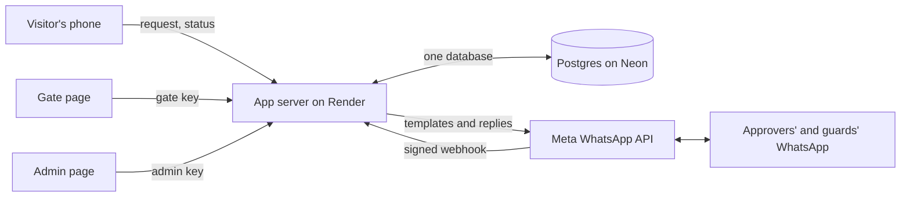

# Safety

This document tells you what the app protects, how it protects it, and what
it does not protect. Read it before real use, and give the known limits to
the people who decide about the campus. To set up the app, read
[setup.md](setup.md). To run it, read [maintenance.md](maintenance.md).

## How the parts fit

One app process holds the web pages, the API and a background timer. The
database is the only record. WhatsApp carries the approvals and the guards'
commands, and Meta signs each webhook call with the app secret.

## Security assumptions

The protections below hold only while these are true:

1. Each guard and admin keeps their own key private, and uses it on their
   own device.
2. A WhatsApp number is held by the person named on the admin page. The app
   cannot tell if someone else took over that account or SIM.
3. The host, University IT, keeps the server settings secret and is the
   only one with access to the database and Render.
4. Meta delivers the webhook calls signed. The app refuses unsigned calls.
5. Render and Cloudflare set the visitor's address in True-Client-IP, and
   nobody can reach the app except through them.

## Who can see what

| Who                     | How                                   | Sees                                                                                                                                        |
|-------------------------|---------------------------------------|---------------------------------------------------------------------------------------------------------------------------------------------|
| A visitor               | Their own private link                | Their own request, its status and its current code                                                                                          |
| An approver             | WhatsApp, from their number           | The requests of their own reasons and offices, and a pass by its code                                                                       |
| A guard                 | Their own key, or the shared gate key | The visits on the gate board, and a pass by its code, with no phone or address, and a WhatsApp message for each approval                    |
| An admin                | Their own key                         | Every request, who decided it, which guard let the visitor in and out, the approvers, offices, allow list, guards, blacklist and change log |
| A super admin           | The main admin key, or their own key  | As an admin, and each gate photo, the downloads, and the admins                                                                             |
| Anybody on the internet | The public pages                      | The forms, the gate desk number, and the health result                                                                                      |

Only an admin key opens the log with every visitor's name, phone
number and address. A guard sees an open visit only, and never its address.

## Keys

1. A gate key opens the gate page and the pass lookups.
   The shared `GATE_KEY` is for the gate desk. Each guard on the admin page
   has a key of their own, so the log names the guard. The database keeps
   only the SHA-256 hash of a guard's key. The admin page shows a new key
   once. `KEY` from a guard's phone makes a new key and stops the old one.
   Remove on the admin page stops the guard's key at once.
2. The admin key opens the admin page. It must be different from the gate
   key. If it is not set, is shorter than 20 characters, or is the same, the
   admin page stays locked, because every guard has the gate key. Each admin
   added in Admins has a key of their own, kept only as a hash, as a
   guard's key is. A guard's number cannot be an admin's number.
3. Each page keeps its key in the browser's storage on that device. On a
   shared device, tap Sign out when you finish. That removes the key. The
   admin page also signs out by itself after 30 minutes with no use.
4. "Forgot key?" sends the key only to its fixed number: the gate key to
   `GUARD`, and the admin key to `ADMIN_PHONE`. The page never shows the key.
   If `ADMIN_PHONE` is the gate desk number, the admin key is not sent.
5. The server compares keys in constant time, so the time of the answer
   tells nothing about the key.
6. `KEY` on WhatsApp gives a new key to whoever holds an added guard's or
   admin's unlocked phone. Every new key and every key sent goes into the
   admin change log, so an admin can see it and delete that person.

There is no lockout after wrong keys. Everyone at one gate shares one
internet address, so a lockout after one person's typing mistakes shuts out
the whole gate. Long random keys make guessing useless instead. The app
refuses a gate key shorter than 20 characters, or the example key from
`.env.example`, and does not start.

## Codes and links

A visit has four identifiers. Each one does one job.

| Identifier | Example              | Who has it      | What it can do                         |
|------------|----------------------|-----------------|----------------------------------------|
| Reference  | `VR-40221`           | Approvers, gate | Names the request. Opens nothing alone |
| Entry code | `KT-4821`            | The visitor     | Records the entry, with the gate key   |
| Exit code  | `RM-0937`            | The visitor     | Records the exit, with the gate key    |
| Token      | 22 random characters | The visitor     | Reads the visitor's own request        |

1. The reference has only 90,000 values, so it is not a secret. At the gate,
   it shows who the visitor is, and it never records an entry. It can record
   the exit of a visitor who is inside and cannot show the exit code, after
   a second tap. An exit cannot let anybody in, and the log marks it as
   "(without the exit code)".
2. The entry and exit codes come from the Python `secrets` module, so one
   code tells nothing about the next. There are about 5.7 million codes. A
   code works only with the gate key.
3. No message, list or export shows a gate code. Only the visitor's own page
   shows one, and only the code for the next step. A WhatsApp reply repeats a
   code only when the sender typed that code.
4. The token is the visitor's private link. The admin list and the gate never
   receive it.

## Pass expiry

A pass works for `PASS_HOURS` after the request, 48 hours by default. After
that time, nobody can approve the request, and the entry code opens nothing,
on the gate page and on WhatsApp.

1. The time check is part of the same database statement that approves or
   lets the visitor in. A pass cannot expire halfway through an entry.
2. A visitor who is already inside can always leave.
3. The visitor's page stops showing the code at the end time, also with no
   signal.

## WhatsApp

1. The app checks Meta's signature on each webhook call with
   `META_APP_SECRET`, and refuses an unsigned or changed call with 403. The
   app does not start without the secret. Only `ALLOW_UNSIGNED_WEBHOOK=true`
   lets it start without one, for a test on your own machine.
2. The app ignores every number that is not an approver, a guard or
   `ADMIN_PHONE`. The app refuses `ADMIN_PHONE` as a guard, so `KEY` never
   sends the admin key to a guard.
3. When a request is approved, the gate desk number gets a message with the
   reference, the visitor's name, the guests, the reason and the person
   visited. It has no gate code, no phone number and no address.
4. The app records each message id, so a message that Meta delivers twice
   runs once.
5. Each reason has its own two approvers. An approver cannot decide the
   request of another reason.
6. A `YES` or `NO` with a reference that does not read correctly decides
   nothing. It never falls back to the request that waits.
7. A field on the form is one line of plain text. The server refuses line
   breaks, control codes and invisible marks, so a visitor cannot add false
   lines to the approver's message.

## The web pages

Every answer from the server has these headers:

| Header                      | What it does                                                                                                                      |
|-----------------------------|-----------------------------------------------------------------------------------------------------------------------------------|
| `Content-Security-Policy`   | Loads scripts, styles and data only from this server                                                                              |
| `X-Frame-Options`           | Stops another site from showing a page in a frame                                                                                 |
| `X-Content-Type-Options`    | Stops the browser from guessing the file type                                                                                     |
| `Referrer-Policy`           | Sends no address to other sites                                                                                                   |
| `Strict-Transport-Security` | Makes the browser use HTTPS for one year                                                                                          |
| `Permissions-Policy`        | Turns off the camera, microphone, location and payment. The gate photo uses the phone's own camera app, which this does not block |

The admin page has a stricter policy: `script-src 'self'` and
`style-src 'self'`, with no `'unsafe-inline'`. Its styles are in
`admin.css`, and it has no inline script, style or handler, so an injected
script cannot run there. The admin page shows every visitor's details, so it
gets the strict policy first.

The visitor page and the gate page still allow inline scripts
(`'unsafe-inline'`). Their buttons call their code from inline `onclick`
attributes, and a stricter policy stops every button. All three pages put
every visitor-typed text through an escape function before they show it, so
typed text cannot become a script.

A CSV cell that starts with `=`, `+`, `-` or `@` gets a quote in front.
Excel and Sheets run such a cell as a formula, so a name such as
`=HYPERLINK(...)` can otherwise run on the computer that opens the log.

## Limits on requests

| Limit              | Value                                                    |
|--------------------|----------------------------------------------------------|
| New requests       | `REQUESTS_PER_HOUR` from one address, 60                 |
| "Forgot key?"      | 3 from one address, 10 in total, each hour, for each key |
| The health address | 30 from one address each minute                          |

People on one campus Wi-Fi share one address, so the request limit is for a
group, not one person. Raise it if a class tests the app at once.

`BEHIND_PROXY` tells the app where to read the caller's address. On Render,
Cloudflare sits in front of Render's own proxies. Cloudflare puts the
visitor's address in the `True-Client-IP` header, and it replaces a value
that the visitor sent, so the app reads that header. It reads no other
header. The last entry of `X-Forwarded-For` is one of Render's internal
proxies, and it changes from call to call, so it cannot identify a visitor.
If `True-Client-IP` is missing, the app counts every visitor as one address
and writes a warning in the log. That stops more requests than it should,
but nobody can get past the limit with an invented address. On your own
machine, nothing sets these headers, and trust in them lets anyone invent an
address. Set `BEHIND_PROXY` to `true` only behind a proxy. Behind a
different proxy, set `CLIENT_IP_HEADER` to the header that proxy sets, see
[setup.md](setup.md).

## Privacy

1. The form asks for a name, a phone number, an address, the reason, and the
   person visited. The guard also takes one photo of the visitor at the
   gate, on the gate page or on WhatsApp.
2. A photo sent on WhatsApp stays in the chat of the guard who took it. The
   app keeps only WhatsApp's id for the photo and the time. A photo taken on
   the gate page is kept in the database, as a small JPEG of about 30 to 40
   KB, and it is deleted with its visit after `RETAIN_DAYS`. The gate page
   draws the photo again before it sends it. The server does not trust that:
   it refuses a file over 150 KB, a file that is not a JPEG, and a photo
   that claims more than 2,000 pixels on a side. Then it decodes the photo
   and stores a new copy with no metadata, so no location or phone details
   reach the database. Only the admin page shows it, one photo at a time.
   The pass, the gate lists, the visitor's page and the CSV log never hold
   it.
3. The approval message to the gate desk stays in the desk phone's WhatsApp chat.
   The app cannot delete it after `RETAIN_DAYS`. The visitor's privacy screen
   says so.
4. The app deletes each visit `RETAIN_DAYS` after the request, 90 days by
   default. The privacy screen states the same number, because it reads it
   from the server.
5. The gate sees the visitor's details while the visit is open. After the
   exit, the gate sees only the times.
6. The phone's copy of the pass holds no phone number and no address. The
   phone deletes the copy when the pass closes or expires.
7. The visitor never sees who approved the request, or that it was approved
   automatically. The number that decided is in the column `decided_phone`.
   Only the admin list and the admin's CSV have it.
8. The guard who let a visitor in or out is in the columns `entered_by` and
   `exited_by`, as a name and a number. Only the admin list and the admin's
   CSV have them. The visitor and the gate never see them.
9. The health address shows only `true` or `false` for the database and for
   WhatsApp. It never shows a reason or a token.

The CSV log holds every personal detail. Keep downloaded copies on a
protected device, and delete them after the retention period.

## Secrets

| Secret                  | Keep it in                                       |
|-------------------------|--------------------------------------------------|
| `DATABASE_URL`          | Render Environment and your own `.env` only      |
| `META_TOKEN`            | Render Environment and your own `.env` only      |
| `META_APP_SECRET`       | Render Environment and your own `.env` only      |
| `GATE_KEY`, `ADMIN_KEY` | Render Environment, and the people who need them |

Never put a secret in git, in a chat or in a screenshot. `.gitignore` keeps
`.env` out of git. If a secret leaks, change it at its source, then in Render.

## Threats and what stops them

| Threat                                 | What stops it                                                                                          |
|----------------------------------------|--------------------------------------------------------------------------------------------------------|
| A false WhatsApp message to the app    | Meta's signature, checked with `META_APP_SECRET`. The app needs the secret                             |
| The same WhatsApp message sent again   | The app records each message id and acts on it once                                                    |
| Two decisions on one request           | The decision is one database statement that changes an open request only                               |
| Two guards on one entry                | The entry is one database statement that changes an approved pass only                                 |
| A guessed reference                    | A reference opens only a visit on the gate board, and each guard has 60 lookups a minute               |
| A guessed entry or exit code           | About 5.7 million random codes, and each one needs a gate key too                                      |
| A guessed visitor link                 | 22 random characters                                                                                   |
| A guessed gate or admin key            | 20 characters or more, required at start                                                               |
| A stolen gate key                      | Remove the guard, or change `GATE_KEY`. A gate key opens no history                                    |
| A stolen admin key                     | Change `ADMIN_KEY` on Render, or tap New key or Delete for an added admin                              |
| An allow list code used by another     | The guard reads the name. The person gets a message about the entry                                    |
| A person the campus has banned         | The blacklist refuses their number, and the admin page lists each attempt                              |
| A ban while a request waits            | The ban declines it. An approval checks the blacklist in the same statement                            |
| An admin change nobody expected        | The admin change log names who made it, also by `KEY` on WhatsApp                                      |
| A stolen gate key lists the staff      | 60 allow list calls a minute for each key                                                              |
| A regular admin acts as a super one    | Only a super admin may renew the key of, delete or change a super admin                                |
| A bulk approval of the wrong rows      | An "Are you sure?" box with the count, and every reference in the log                                  |
| Two guards record one staff entry      | One scan for each code in 2 minutes, with a database lock                                              |
| A missed staff scan flips in and out   | The banner says entry or exit. Change, or IN or OUT, fixes it. A scan looks back 16 hours only         |
| A guard's second IN before the photo   | Refused until the first photo arrives, or CANCEL. A photo never goes to the wrong visitor              |
| Two countries share the last 10 digits | The blacklist compares the full number with its country code                                           |
| A visitor's link or a code in a log    | Access log lines show `<hidden>` in place of the token or code                                         |
| One webhook payload with many messages | Each message acts once, by its id. A message with no id is left out                                    |
| Many addresses flood the approvers     | `REQUESTS_PER_HOUR_ALL` for the whole campus, default 300 an hour                                      |
| A stolen WhatsApp account or SIM       | Remove that number on the admin page at once. The change log shows what it did                         |
| A stolen or lost gate phone            | Lock on the gate page, or delete the guard to stop their key. The gate also locks after 8 hours unused |
| An admin who abuses their access       | Only super admins add admins or see faces. Every change is in the change log                           |
| No network at the gate                 | The board says so. The paper log in university-deployment.md takes over                                |
| Meta is down                           | New requests cannot reach approvers. The gate still checks approved passes                             |
| A visitor sends one form twice         | A random key from their browser: the second send gets the first request                                |
| False lines in the approver message    | The form refuses line breaks, control codes and invisible marks                                        |
| A formula in the CSV log               | Cells that start with `=`, `+`, `-` or `@` get a quote in front                                        |
| A harmful photo file                   | Size and pixel limits, then the server decodes it and stores a new copy                                |
| Many requests from one place           | `REQUESTS_PER_HOUR` for each address, and limits on "Forgot key?"                                      |
| A guard who reads the whole history    | Only an admin key opens the log. The gate never gets an address or phone                               |
| Any admin copies every face            | Only a super admin can download the logs and the photos                                                |
| A send that may have reached Meta      | The request stays, is never approved by itself, and the reminder asks again                            |
| Open requests after an approver change | They go to the new approver at once, and the change log counts them                                    |
| SQL in a form, a message or a search   | Every value goes to the database as a parameter, never as SQL text                                     |
| A NUL byte, or a list as the body      | The server answers 400 with a plain error, never a crash                                               |

## What lives only in the server's memory

The database is the record. These live in the app process only, and a
restart or a new deployment clears them:

1. The rate limits. After a restart, each caller starts again at zero.
2. The cached reads, such as the gate board and the blacklist index. The
   next read fills them from the database again.
3. The background timer's next run time. It works it out again at start.

No visit, decision, entry or exit is held only in memory, so a restart loses
none of them. The app runs as one worker on purpose: two workers would each
have their own limits and caches, and would send each reminder twice.

## Known limits

Tell the people who decide about the campus about these limits.

1. The log names a guard only when that guard uses their own key. Anyone
   with the shared `GATE_KEY` records as "Gate desk (shared key)". A removed
   guard who knows `GATE_KEY` can still use it until you change it.
2. The app makes sure that each entry has a photo and the name of the
   guard. It cannot prove that the photo shows the visitor, or that the
   guard took it just now. The page asks the phone for its camera, but some
   browsers also allow a photo from the gallery. The admin can look at the
   photo afterward.
3. The app does not check that a visitor's phone number is real.
4. Someone with many internet addresses can send many requests. Each request
   sends a WhatsApp template message, which Meta charges for on a real
   number.
5. The visitor's browser holds the only link to their request. A visitor who
   clears the browser or changes phones must send a new request.
6. The free database holds roughly 12,000 visits with photos. Keep the
   visits that the app stores under that number, see
   [maintenance.md](maintenance.md).
7. On the free Render plan, the app sleeps after 15 quiet minutes. The first
   request after that waits up to about a minute, and reminders and automatic
   approvals wait until the app wakes.
8. With no signal at the gate, the guard cannot check any pass.
9. The visitor page and the gate page allow inline scripts, see "The web
   pages". The admin page does not.
10. On the free Neon plan, the database can be restored only to a time in the
    last 6 hours. The weekly `pg_dump` backup is the longer one, see "Back up
    and restore the database" in [maintenance.md](maintenance.md). Download
    logs is a record for people. The app cannot load it again.
11. The approval message to the gate desk is plain text. WhatsApp delivers it
    only if the desk phone wrote to the app's number in the last 24 hours.
12. A person on the allow list says their code aloud at the gate, so anyone
    who hears it can use it. The guard must check the name in the reply
    against the person. The person gets a message about each entry, but only
    when `STAFF_ENTRY_TEMPLATE` is set, or when they wrote to the app's
    number in the last 24 hours.
13. A staff exit depends on the guard's scan. One scan is an entry, the next
    scan within 16 hours is an exit. A missed scan swaps entry and exit for
    that person until a guard changes it, and an entry with no exit reads
    EXIT NOT RECORDED in the staff log.
14. Every admin can change the approvers, the offices, the guards, the allow
    list and the blacklist. Only a super admin can add or delete an admin,
    see the gate photos and download the logs.
15. The blacklist knows only phone numbers. A banned person can use another
    phone, or come as a guest named on someone else's request.
16. The log download holds the gate page photos. A downloaded copy stays
    after the app deletes the record at `RETAIN_DAYS`.
17. The app cannot cancel an approved pass. To stop a pass, put the
    visitor's number on the blacklist: the gate then refuses the pass. After an outage, a pass used on
    the paper log stays usable until it expires, see "When the system is
    down" in [university-deployment.md](university-deployment.md).
